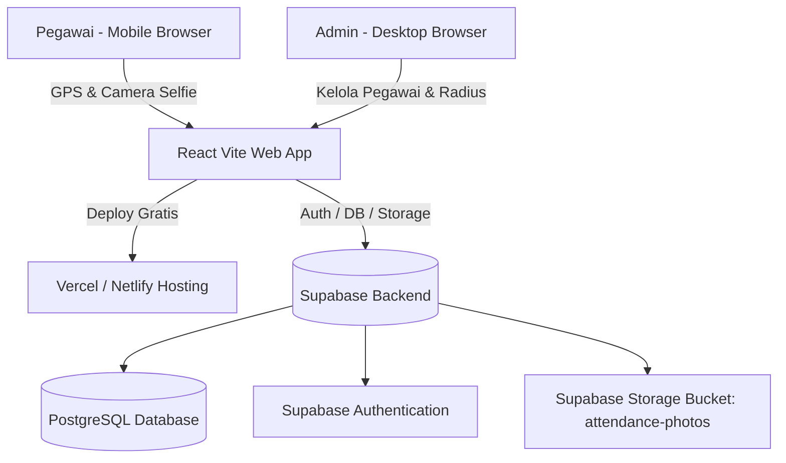

# Design Specification: Aplikasi Absensi Pegawai (Free Tier Stack)

## 1. Executive Summary & Purpose
Aplikasi Absensi Pegawai berbasis Web Responsive dirancang untuk mencatat absensi pegawai secara akurat, transparan, dan aman dengan memanfaatkan **100% tools gratis** (Free Tier Stack). Aplikasi ini mendukung verifikasi lokasi presisi (GPS Geolocation), bukti fisik (Foto Selfie), serta penanganan jadwal kerja khusus untuk Pegawai Reguler dan Pegawai Shift (Pamdal).

---

## 2. Decision Log (Catatan Keputusan Desain)
| No | Topik | Keputusan | Alternatif Dipertimbangkan | Alasan Pemilihan |
|----|-------|-----------|----------------------------|------------------|
| 1 | **Platform** | Web Application (Responsive Mobile & Desktop) | Native Android/iOS App | Bebas biaya developer account PlayStore/AppStore, langsung dapat diakses via browser HP/Laptop. |
| 2 | **Tech Stack & Hosting** | React + Vite + Tailwind/CSS + Supabase SDK (Free Tier) | Next.js SSR, Firebase, Google Sheets | YAGNI, performa SPA super cepat, free tier database PostgreSQL + Storage 1GB + Auth, hosting Vercel/Netlify. |
| 3 | **Validasi Absensi** | GPS Geolocation (Radius Jarak Kantor) & Foto Selfie Bukti | QR Code, Tombol Absen Sederhana | Mencegah titip absen & memvalidasi keberadaan fisik di radius kantor. |
| 4 | **Peran Pengguna (Roles)** | 2 Roles: `Admin` & `Pegawai` | 3 Roles (+ Supervisor) | Sederhana & mencakup seluruh fungsi kelola data, pengesetan lokasi, dan absensi. |
| 5 | **Jadwal Kerja** | - Reguler: Senin-Kamis (08:00-16:00), Jumat (08:00-16:30) - Pamdal: Shift Siang (08:00-20:00), Shift Malam (20:00-08:00 esok hari) | Single Fixed Schedule | Mengakomodasi kebutuhan operasional riil pegawai kantor & tim pengamanan (Pamdal). |

---

## 3. Architecture & Data Flow

---

## 4. Database Schema (Supabase PostgreSQL)

### 4.1 Tabel `profiles`
Menampung data identitas pegawai dan perannya.
- `id` (UUID, Primary Key, Foreign Key ke `auth.users.id`)
- `nama_lengkap` (VARCHAR)
- `nip` (VARCHAR, Unique)
- `role` (VARCHAR: `'admin'` | `'pegawai'`)
- `kategori_pegawai` (VARCHAR: `'reguler'` | `'pamdal'`)
- `created_at` (TIMESTAMPTZ)

### 4.2 Tabel `company_settings`
Menampung lokasi kantor dan konfigurasi jam kerja.
- `id` (INT, Primary Key)
- `nama_kantor` (VARCHAR)
- `latitude` (FLOAT8)
- `longitude` (FLOAT8)
- `radius_meter` (INT, default: `50`)
- `jam_masuk_reguler` (TIME, default: `'08:00'`)
- `jam_pulang_senin_kamis` (TIME, default: `'16:00'`)
- `jam_pulang_jumat` (TIME, default: `'16:30'`)
- `jam_masuk_pamdal_siang` (TIME, default: `'08:00'`)
- `jam_pulang_pamdal_siang` (TIME, default: `'20:00'`)
- `jam_masuk_pamdal_malam` (TIME, default: `'20:00'`)
- `jam_pulang_pamdal_malam` (TIME, default: `'08:00'`)

### 4.3 Tabel `attendances`
Menampung log transaksi absensi masuk dan pulang.
- `id` (UUID, Primary Key, default: `gen_random_uuid()`)
- `user_id` (UUID, Foreign Key ke `profiles.id`)
- `tanggal_shift` (DATE)
- `shift_type` (VARCHAR: `'reguler'`, `'pamdal_siang'`, `'pamdal_malam'`)
- `waktu_masuk` (TIMESTAMPTZ)
- `waktu_pulang` (TIMESTAMPTZ, Nullable)
- `lat_masuk` (FLOAT8), `lng_masuk` (FLOAT8)
- `lat_pulang` (FLOAT8, Nullable), `lng_pulang` (FLOAT8, Nullable)
- `foto_masuk_url` (TEXT), `foto_pulang_url` (TEXT, Nullable)
- `status_masuk` (VARCHAR: `'tepat_waktu'`, `'terlambat'`)
- `status_pulang` (VARCHAR: `'tepat_waktu'`, `'pulang_cepat'`, Nullable)
- `jarak_masuk_meter` (FLOAT8), `jarak_pulang_meter` (FLOAT8, Nullable)

### 4.4 Supabase Storage
- Bucket Name: `attendance-photos` (Public URL / RLS Signed URL)
- Kompresi gambar client-side (Max 800x800px JPEG 70%, file size ~50KB-100KB per foto).

---

## 5. Security & Row Level Security (RLS)
- **Tabel `profiles`**:
  - User dapat membaca profil miliknya sendiri.
  - Admin dapat membaca & mengubah seluruh profil pegawai.
- **Tabel `attendances`**:
  - Pegawai hanya dapat membuat (INSERT) dan membaca (SELECT) data absensi milik `auth.uid() = user_id`.
  - Admin memiliki hak SELECT/UPDATE/DELETE penuh.
- **Tabel `company_settings`**:
  - Seluruh pengguna terautentikasi dapat membaca (SELECT).
  - Hanya Admin yang dapat memperbarui (UPDATE).

---

## 6. User Interface & Feature Workflow

### 6.1 Interface Pegawai
1. **Login Screen**: NIP & Password.
2. **Dashboard Absensi**:
   - Pilihan Shift (Otomatis terdeteksi berdasarkan waktu/kategori pegawai).
   - Pengukur Jarak Real-Time (Haversine Distance meter dari lokasi kantor).
   - Indikator Status: `Dalam Radius Kantor (≤ 50m)` vs `Di Luar Radius Kantor`.
   - Preview Kamera Live & Button **Clock In** / **Clock Out**.
3. **Riwayat Absensi**: Daftar absensi bulanan, status keterlambatan, dan preview foto selfie.

### 6.2 Interface Admin
1. **Dashboard Monitoring**: Ringkasan kehadiran harian (Jumlah Hadir, Terlambat, Belum Absen).
2. **Kelola Pegawai**: Tambah pegawai baru, ubah kategori (Reguler / Pamdal), reset password.
3. **Pengaturan Kantor**: Map picker / input lat-lng koordinat kantor & batas radius meter.
4. **Laporan & Ekspor**: Filter rentang tanggal / nama pegawai dan tombol **Export Excel / PDF**.

---

## 7. Edge Cases & Error Handling
1. **Shift Malam Pamdal (Lintas Hari)**: Absen masuk jam 20:00 tanggal N, Absen pulang jam 08:00 tanggal N+1. Sistem mencatat `tanggal_shift` sama dengan tanggal masuk sehingga jam pulang terhubung dengan record yang benar.
2. **GPS Accuracy & Spoofing**: Melakukan pembacaan GPS dengan opsi `enableHighAccuracy: true` dan ambang batas toleransi akurasi browser (< 50m).
3. **Optimasi Media**: Kamera mengambil snapshot Canvas & melakukan kompresi data gambar sebelum dikirim ke Supabase Storage.
